## はじめに
データベースのER図は下記になります。



## 前提条件
- DockerおよびDocker Composeがインストールされていることを確認してください。
- gitがインストールされていることを確認してください。

## Dockerを使用してMySQLの環境構築
ローカル上にこのプロジェクトの環境クローンし、MySQLにデータを取り込む方法を記載します。

### 1. git cloneを実行
gitを使用して。Github上にあるコードをローカルPCに持ってきます。
ターミナルから任意のプロジェクトに移動し、下記コードを実行します。
```bash
git clone [URL]
```

### 2. コンテナの起動
次のコマンドを使用して、定義したサービスのコンテナを起動します。
```bash
docker compose up -d
```

### 3. データの取り込み
コンテナが正常に起動した後、以下のコマンドを実行してMySQLコンテナにアクセスし、SQLファイルを使用してデータを取り込みます。
```bash
docker exec -it db_internet_tv mysql -u root -p
```
プロンプトが表示されたら、設定したパスワード「password」を入力します。次に、以下のコマンドを使用してデータを取り込みます。
```bash
source /sql/load_data.sql
```
このコマンドは、マウントした/sqlディレクトリ内のload_data.sqlファイルを実行し、CSVファイルからデータをMySQLデータベースに取り込みます。
