## データベース設計
### テーブルの設計は下記になります。

#### Users Table

| カラム名   | データ型        | NULL | キー     | 初期値 | AUTO INCREMENT |
|---------|--------------|------|--------|-------|----------------|
| id      | INT          |      | PRIMARY |       | YES            |
| nickname| VARCHAR(255) |      |        |       | NO             |
| Plan    | VARCHAR(255) |      |        |       | NO             |

#### Channel Table

| カラム名 | データ型        | NULL | キー     | 初期値 | AUTO INCREMENT |
|--------|--------------|------|--------|-------|----------------|
| id     | INT          |      | PRIMARY |       | YES            |
| name   | VARCHAR(255) |      |        |       | NO             |

#### Programs Table

| カラム名     | データ型     | NULL | キー     | 初期値 | AUTO INCREMENT |
|------------|-----------|------|--------|-------|----------------|
| id         | INT       |      | PRIMARY |       | YES            |
| title      | VARCHAR(255) |      |        |       | NO             |
| description| TEXT      | YES  |        |       | NO             |
| genre      | VARCHAR(255) | YES  |        |       | NO             |

#### Seasons Table

| カラム名      | データ型     | NULL | キー     | 初期値 | AUTO INCREMENT | 外部キー       |
|-------------|-----------|------|--------|-------|----------------|-------------|
| id          | INT       |      | PRIMARY |       | YES            |             |
| program_id  | INT       |      | FOREIGN |       | NO             | Programs(id) |
| season_number| INT       |      |        |       | NO             |             |
| season_title| VARCHAR(255) | YES  |        |       | NO             |             |
| year        | INT       | YES  |        |       | NO             |             |

#### Episodes Table

| カラム名       | データ型     | NULL | キー     | 初期値 | AUTO INCREMENT | 外部キー     |
|--------------|-----------|------|--------|-------|----------------|-----------|
| id           | INT       |      | PRIMARY |       | YES            |           |
| season_id    | INT       |      | FOREIGN |       | NO             | Seasons(id)|
| episode_number| INT       |      |        |       | NO             |           |
| title        | VARCHAR(255) |      |        |       | NO             |           |
| description  | TEXT      | YES  |        |       | NO             |           |
| duration     | INT       | YES  |        |       | NO             |           |

#### Broadcasts Table

| カラム名    | データ型      | NULL | キー     | 初期値 | AUTO INCREMENT | 外部キー       |
|-----------|------------|------|--------|-------|----------------|-------------|
| id        | INT        |      | PRIMARY |       | YES            |             |
| channel_id| INT        | YES  | FOREIGN |       | NO             | Channel(id)  |
| episode_id| INT        | YES  | FOREIGN |       | NO             | Episodes(id) |
| start_time| DATETIME   |      |        |       | NO             |             |
| end_time  | DATETIME   |      |        |       | NO             |             |

#### Views Table

| カラム名     | データ型      | NULL | キー     | 初期値 | AUTO INCREMENT | 外部キー      |
|------------|------------|------|--------|-------|----------------|-------------|
| id         | INT        |      | PRIMARY |       | YES            |             |
| episode_id | INT        |      | FOREIGN |       | NO             | Episodes(id) |
| user_id    | INT        |      | FOREIGN |       | NO             | Users(id)    |
| watched_time| DATETIME  |      |        |       | NO             |             |

### データベースのER図は下記になります。



### 実行ファイルは/sql内の「step3-..」ファイルになります。
```
├── Dockerfile
├── ER.drawio.svg
├── ER.svg
├── compose.yaml
├── csv
│   ├── Broadcasts.csv
│   ├── Channel.csv
│   ├── Episodes.csv
│   ├── Programs.csv
│   ├── Seasons.csv
│   ├── Users.csv
│   └── Views.csv
└── sql
    ├── init.sql
    ├── load_data.sql
    ├── step3-1.sql
    ├── step3-2.sql
    ├── step3-3.sql
    ├── step3-4.sql
    ├── step3-5.sql
    ├── step3-6.sql
    └── test.sql
```

## 前提条件
- DockerおよびDocker Composeがインストールされていることを確認してください。
- gitがインストールされていることを確認してください。

## Dockerを使用してMySQLの環境構築
ローカル上にこのプロジェクトの環境クローンし、MySQLにデータを取り込む方法を記載します。

### 1. git cloneを実行
gitを使用して。Github上にあるコードをローカルPCに持ってきます。
ターミナルから任意のプロジェクトに移動し、下記コードを実行します。
```bash
git clone [URL]
```

### 2. コンテナの起動
次のコマンドを使用して、定義したサービスのコンテナを起動します。
```bash
docker compose up -d
```

### 3. データの取り込み
コンテナが正常に起動した後、以下のコマンドを実行してMySQLコンテナにアクセスし、SQLファイルを使用してデータを取り込みます。
```bash
docker exec -it db_internet_tv mysql -u root -p
```
プロンプトが表示されたら、設定したパスワード「password」を入力します。次に、以下のコマンドを使用してデータを取り込みます。
```bash
source /sql/load_data.sql
```
このコマンドは、マウントした/sqlディレクトリ内のload_data.sqlファイルを実行し、CSVファイルからデータをMySQLデータベースに取り込みます。
